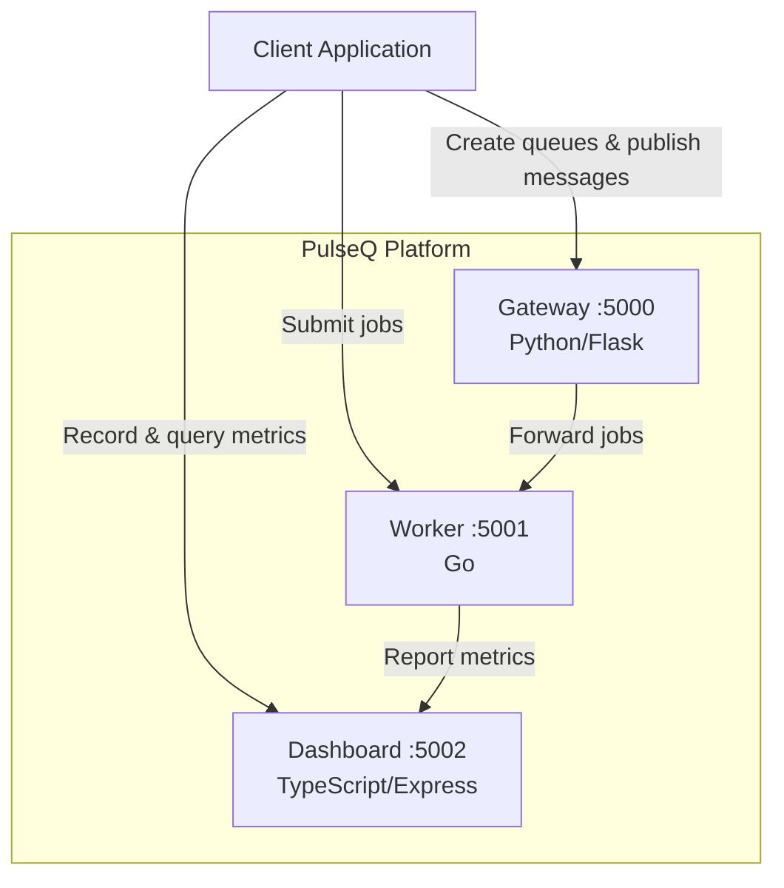

# PulseQ

Real-time message queue monitoring and analytics platform with a multi-service architecture.

## Overview

PulseQ provides a lightweight, self-contained message queue system with built-in monitoring and analytics. It consists of three microservices that work together to manage queues, process messages, and track performance metrics.

## Architecture



## Services

| Service | Language | Port | Description |
|---------|----------|------|-------------|
| Gateway | Python (Flask) | 5000 | API gateway for queue management and message publishing |
| Worker | Go | 5001 | Message processing worker with job tracking |
| Dashboard | TypeScript (Express) | 5002 | Metrics collection and analytics API |

## Quick Start

### Prerequisites

- Docker & Docker Compose
- Make (optional, for shortcuts)

### Setup

```bash
# Clone the repository
git clone https://github.com/mohadayo/pulseq.git
cd pulseq

# Copy environment config
cp .env.example .env

# Start all services
make up
# or: docker compose up --build -d

# Verify health
make health
```

### Running Tests Locally

```bash
# Run all tests
make test

# Run linting
make lint

# Individual services
make test-gateway
make test-worker
make test-dashboard
```

## API Specification

### Gateway (port 5000)

| Method | Endpoint | Description |
|--------|----------|-------------|
| GET | `/health` | Health check |
| POST | `/queues` | Create a queue (`{"name": "..."}`) |
| GET | `/queues` | List all queues |
| POST | `/queues/:name/messages` | Publish a message (`{"body": "..."}`) |
| GET | `/queues/:name/messages` | Get messages in a queue |
| GET | `/queues/:name/stats` | Get queue statistics |

### Worker (port 5001)

| Method | Endpoint | Description |
|--------|----------|-------------|
| GET | `/health` | Health check |
| POST | `/process` | Process a job (`{"id": "...", "queue_name": "...", "body": "..."}`) |
| GET | `/stats` | Get worker statistics |
| GET | `/jobs` | List processed jobs |

### Dashboard (port 5002)

| Method | Endpoint | Description |
|--------|----------|-------------|
| GET | `/health` | Health check |
| POST | `/metrics` | Record a metric (`{"name": "...", "value": N, "labels": {...}}`) |
| GET | `/metrics` | List all recorded metrics |
| GET | `/metrics/summary` | Get aggregated metric summaries |
| DELETE | `/metrics` | Clear all metrics |

## Usage Examples

```bash
# Create a queue
curl -X POST http://localhost:5000/queues \
  -H "Content-Type: application/json" \
  -d '{"name": "orders"}'

# Publish a message
curl -X POST http://localhost:5000/queues/orders/messages \
  -H "Content-Type: application/json" \
  -d '{"body": "order-12345"}'

# Process a job
curl -X POST http://localhost:5001/process \
  -H "Content-Type: application/json" \
  -d '{"id": "job-1", "queue_name": "orders", "body": "order-12345"}'

# Record a metric
curl -X POST http://localhost:5002/metrics \
  -H "Content-Type: application/json" \
  -d '{"name": "queue.depth", "value": 42, "labels": {"queue": "orders"}}'

# View metrics summary
curl http://localhost:5002/metrics/summary
```

## Environment Variables

| Variable | Default | Description |
|----------|---------|-------------|
| `GATEWAY_PORT` | 5000 | Gateway service port |
| `WORKER_PORT` | 5001 | Worker service port |
| `DASHBOARD_PORT` | 5002 | Dashboard service port |
| `LOG_LEVEL` | INFO | Logging level (DEBUG, INFO, WARNING, ERROR) |
| `NODE_ENV` | production | Node.js environment |

## CI/CD

GitHub Actions workflow runs on every push and PR to `main`:
1. Lint and test each service independently
2. Build Docker images to verify containerization

> **Note**: The `.github/workflows/ci.yml` file may need to be manually added after initial repository setup due to GitHub API limitations.

## Development

```bash
# Stop all services
make down

# View logs
make logs

# Rebuild
make build
```

## License

MIT
